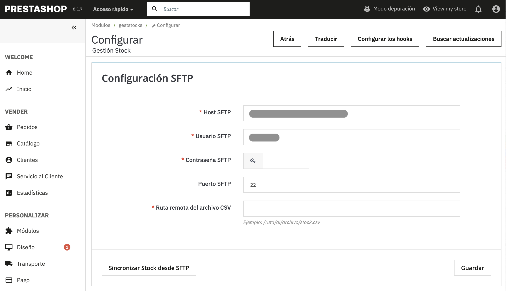

# Módulo PrestaShop: GestStocks

## 📦 Funcionalidades

- Configuración de conexión FTP desde el backoffice.
- Exportación manual de:
  - Productos
  - Proveedores
  - Pedidos
- Generación de archivos CSV listos para ser integrados con sistemas externos.
- Registro de errores en el log de PrestaShop en caso de fallo en la conexión o exportación.

## ⚙️ Requisitos

- PrestaShop 8.x
- Acceso a un servidor FTP externo
- Permisos de escritura en la carpeta `/modules/geststocks/exports` si se usa como caché temporal

## 🚀 Instalación

1. **Subir el módulo**  
   Copia la carpeta del módulo `geststocks` al directorio `/modules` de tu instalación de PrestaShop.

2. **Instalar desde el backoffice**  
   Ve a _Módulos > Módulos del sitio_ y busca “GestStocks”. Haz clic en “Instalar”.

3. **Configurar el módulo**  
   Una vez instalado, accede a la configuración del módulo e introduce los datos del servidor FTP:
   - Host
   - Usuario
   - Contraseña
   - Puerto (por defecto 21)

4. **Usar las funciones de exportación**  
   Desde la misma configuración del módulo podrás hacer clic en los botones:
   - _Exportar productos_
   - _Exportar proveedores_
   - _Exportar pedidos_

   Los archivos generados se subirán automáticamente al servidor FTP configurado.

## 🛠 Estructura del módulo

- `geststocks.php`: archivo principal del módulo.
- `/classes/`
  - `FTPHandler.php`: clase encargada de manejar la conexión FTP.
  - `ProductExport.php`: lógica de exportación de productos.
  - `SupplierExport.php`: lógica de exportación de proveedores.
  - `OrderExport.php`: lógica de exportación de pedidos.
- `/exports/`: (opcional) carpeta temporal para los archivos generados antes de subirlos por FTP.

## 🧩 Personalización

Puedes extender el módulo fácilmente para incluir:
- Exportaciones programadas mediante cron.
- Otros formatos de archivo (XML, JSON, etc.).
- Integración directa con APIs externas en lugar de FTP.

## ❗ Soporte

Si encuentras un error, asegúrate de que el log de PrestaShop no muestra errores de conexión FTP o escritura. También verifica los permisos de carpetas.

---

